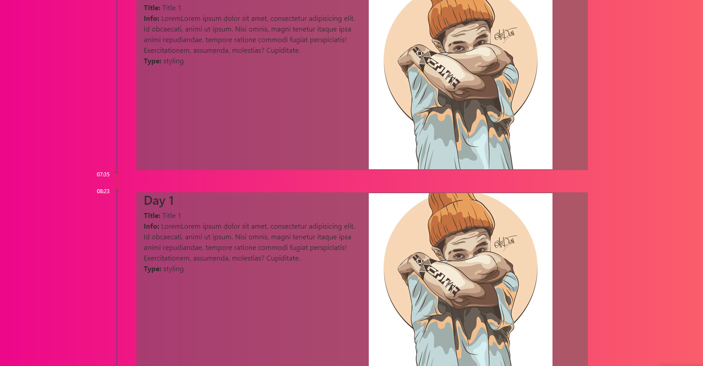

# Special for DYNINNO

In This small project i've created a webpage, where you can easely 
add a different steps of your developing process.

All information are displayed by MySql database.

### I used to work with:

* PHP
* MySQLi
* JavaScript
* CSS
* Ajax
* Animate.css [link to animate.css](https://daneden.github.io/animate.css)